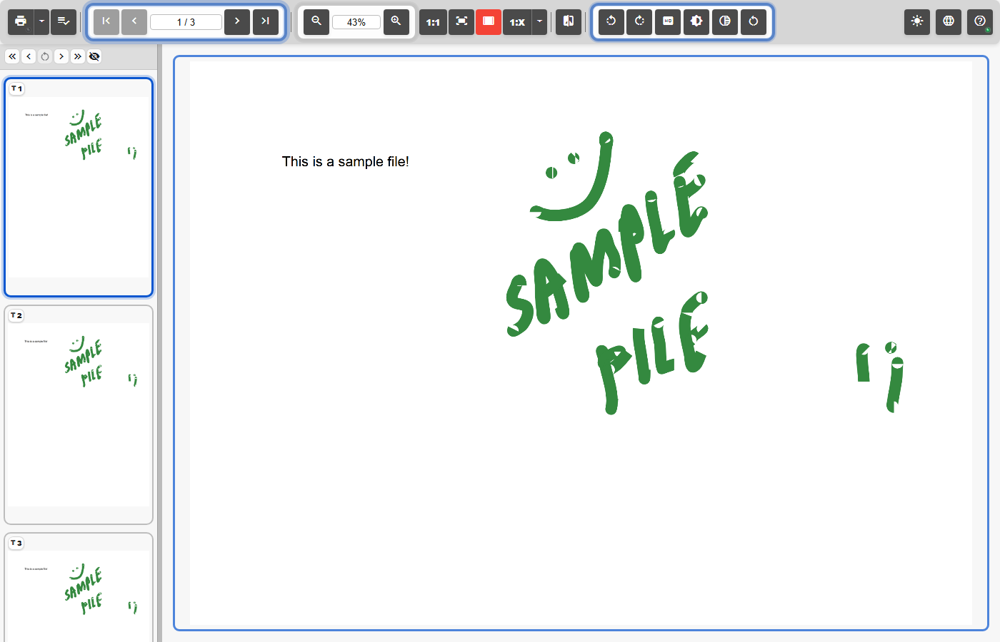
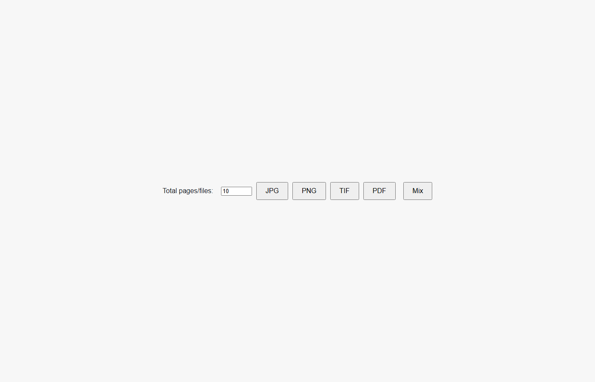
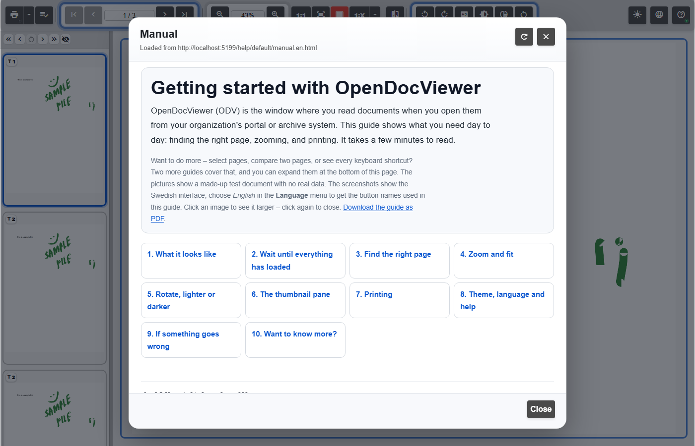
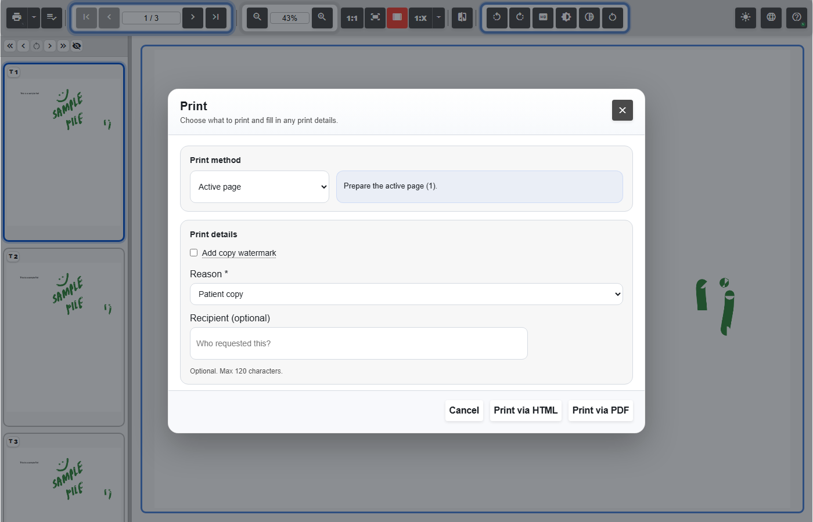
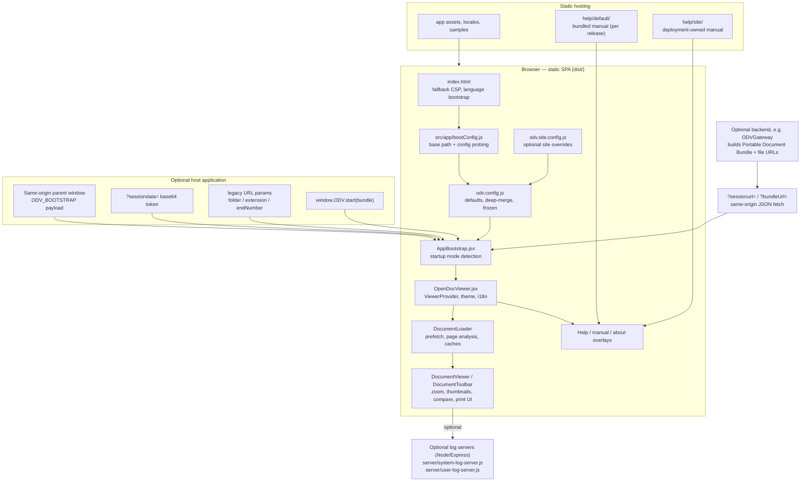
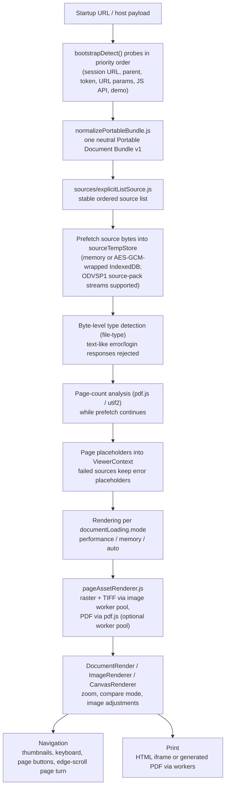
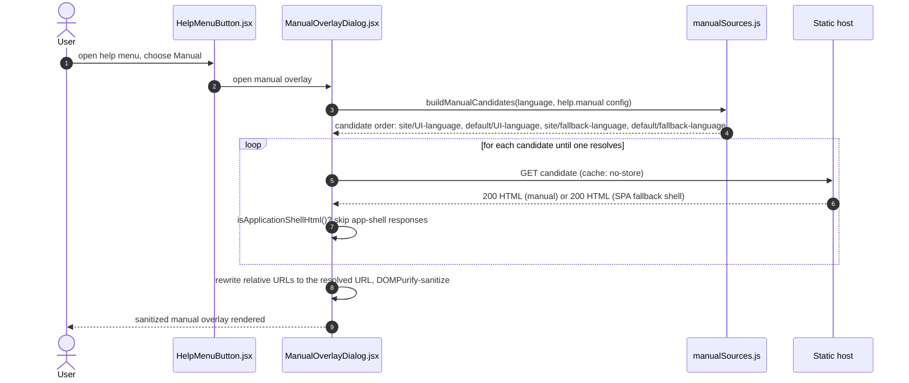

# OpenDocViewer

OpenDocViewer is a browser-based document viewer for **PDF**, **TIFF**, and common raster image formats (JPG/PNG), built with **React 19 + Vite 8**, deployed as static files, and integrable into host applications through a documented JSON bundle contract.

[](https://github.com/Optimal2/OpenDocViewer/actions/workflows/ci.yml)
[](LICENSE)
[](package.json)
[](package.json)

---

## Table of contents

- [What it is / what it is not](#what-it-is--what-it-is-not)
- [Screenshots](#screenshots)
- [Architecture overview](#architecture-overview)
- [How a document session loads](#how-a-document-session-loads)
- [Manuals and help](#manuals-and-help)
- [Requirements](#requirements)
- [Quick start](#quick-start)
- [Running tests](#running-tests)
- [Runtime configuration](#runtime-configuration)
- [Printing](#printing)
- [Logging](#logging)
- [Hosting and deployment](#hosting-and-deployment)
- [Security](#security)
- [Development workflow](#development-workflow)
- [OMP module packaging](#omp-module-packaging)
- [Documentation map](#documentation-map)
- [Troubleshooting notes](#troubleshooting-notes)
- [License](#license)

---

## What it is / what it is not

**What it is**

- A static single-page application: build it once (`npm run build`), host `dist/` on any static server (IIS, Nginx, Apache, S3/CloudFront).
- A viewer for PDF (via `pdfjs-dist` 6.3), TIFF (via `utif2` 4.1), and raster images (JPG/PNG).
- Embeddable: a host application (or an optional backend such as ODVGateway) can hand over documents as a **Portable Document Bundle v1** JSON payload through several documented startup modes.
- Localized in English and Swedish (`public/locales/`, ICU messages via `i18next-icu`).
- Shipped with an optional pair of Node/Express log servers for operational tracing and print auditing.
- Packaged as an OpenModulePlatform (OMP) web-app component for platform-managed deployments.

**What it is not**

- Not a document management system, archive, or search engine.
- Not an authentication or authorization layer — hosts own permissions, workflow state, and audit rules; the viewer only displays what it is given (`docs-src/integrations.md`).
- Not a PDF editor, OCR, or conversion service.
- Not dependent on any server at runtime — the frontend is fully static; the log servers are opt-in.

## Screenshots

All screenshots show the bundled sample files from `public/` (`sample.pdf`, `sample.tif`, `sample.jpg`, `sample.png`) in the Vite dev server.

| Viewer with sample PDF | Demo launcher |
| --- | --- |
|  |  |

| Bundled manual overlay | Print dialog |
| --- | --- |
|  |  |

## Architecture overview

The application is a static SPA split into five layers: boot/startup, application shell, document loading/rendering, viewer interaction, and operational support. Deployment-owned files (`odv.site.config.js`, `help/site/`) survive upgrades; everything else is replaced by each release.



*Derived from: `index.html`, `src/app/bootConfig.js`, `public/odv.config.js`, `src/app/AppBootstrap.jsx`, `src/app/OpenDocViewer.jsx`, `src/components/DocumentLoader/`, `src/components/DocumentViewer/`, `src/components/DocumentToolbar/`, `src/integrations/`, `server/`, `public/help/` (see `docs-src/architecture.md`).*

## How a document session loads

On startup, `src/integrations/bootstrapRuntime.js` probes the available startup sources in a fixed priority order and takes the first one that yields a bundle with at least one document:

| Priority | Mode | Transport | Source module |
| --- | --- | --- | --- |
| 1 | Session URL | `?sessionurl=` / `?bundleUrl=` — same-origin JSON fetch (180 s timeout, 256 MB cap). An explicit session URL that fails leaves the viewer in demo mode with the diagnosis `session-url-unavailable` instead of falling through. | `src/integrations/sessionUrl.js` |
| 2 | Parent page | `window.parent.ODV_BOOTSTRAP` / `window.opener.ODV_BOOTSTRAP`, same-origin only; filtered by `sessiondata.caseIds` when present. | `src/integrations/parentBridge.js` |
| 3 | Session token | `?sessiondata=` — Base64 JSON with hard size limits (200 000 encoded / 150 000 decoded characters). | `src/integrations/sessionToken.js` |
| 4 | URL parameters | Legacy pattern mode: `folder` + `extension` + `endNumber`. | `src/integrations/urlParams.js` |
| 5 | JS API | `window.ODV.start(payload)`, consumed once. | `src/integrations/bootstrapRuntime.js` |
| 6 | Demo | Fallback launcher built from the sample files in `public/`. | `src/app/AppBootstrap.jsx` |

URL payloads deliberately win over the parent bridge: a gateway integration can run inside a host page that still exposes its original bootstrap data, and choosing the parent first would silently bypass the prepared gateway bundle.

Every accepted payload shape is normalized by `src/integrations/normalizePortableBundle.js` into one neutral `PortableDocumentBundle` (`src/schemas/portableBundle.js`), so the rest of the application never needs to know which transport was used.



*Derived from: `src/integrations/bootstrapRuntime.js`, `src/integrations/normalizePortableBundle.js`, `src/components/DocumentLoader/DocumentLoader.js`, `src/components/DocumentLoader/sources/explicitListSource.js`, `src/utils/sourceTempStore.js`, `src/utils/pageAssetRenderer.js`, `src/contexts/ViewerProvider.jsx`, `src/components/DocumentRender.jsx` (see `docs-src/architecture.md` and `docs-src/integrations.md`).*

Loading policy in brief (`documentLoading.mode`, normalized by `src/utils/documentLoadingConfig.js`):

- `performance` — sequential ticket-safe fetch order, aggressive page warming, worker-backed raster/TIFF rendering, larger in-memory caches
- `memory` — conservative lazy rendering around the viewport, earlier persistence and object-URL eviction
- `auto` (default) — starts like `performance`, degrades one-way toward `memory` when page count or browser memory pressure crosses configured thresholds

Rendered page assets are persisted in a second cache layer (`src/utils/pageAssetStore.js`), so later navigation and printing can usually reuse the same blob without re-rendering.

## Manuals and help

The help menu offers a built-in quick-help overlay, a full manual overlay, and an About dialog (version, build id, support diagnostics download). The manual is an HTML fragment resolved at runtime — **the site-local manual under `help/site/` wins over the bundled default under `help/default/`**, so a deployment can replace the manual without rebuilding the viewer.



*Derived from: `src/components/DocumentToolbar/ManualOverlayDialog.jsx`, `src/utils/manualSources.js`, `public/help/site/` (sample templates only), `public/help/default/` (bundled manuals, `manual.<lng>.html`).*

Notes:

- `help/site/*.sample.html` files are templates and are never candidates (`manualSources.js`).
- Static hosts with an SPA fallback answer a missing file with `index.html` and status 200; the `data-odv-bootstrap` marker on the app shell's script tag is used to detect and skip those responses.
- The About dialog shows the application version and build id and offers the support diagnostics download (`src/utils/supportDiagnostics.js`).

## Requirements

- **Node.js** `^22.18.0 || >=24.11.0` (for build, tests, and the optional log servers) — see `engines` in `package.json`
- Primary target browsers: **Microsoft Edge** and **Google Chrome** (Chromium)
- Firefox may work for basic viewing but is not the primary support target and may differ in diagnostics and HTML input-validation behavior; Safari is not the primary operational target
- Static hosting for the built frontend; a Node.js runtime only if you run the optional log servers

## Quick start

```bash
git clone https://github.com/Optimal2/OpenDocViewer.git
cd OpenDocViewer
npm install
npm run dev
```

Open the local Vite URL (typically `http://localhost:5173`). With no host payload present, the viewer shows the **demo launcher**, which builds a source list from the sample files in `public/` (`sample.pdf`, `sample.tif`, `sample.jpg`, `sample.png`). Pick a format and a page count to open the viewer.

To develop with the optional log servers running alongside:

```bash
npm run dev:both
```

## Running tests

The test suite uses [Vitest](https://vitest.dev/) and needs nothing beyond `npm install`:

```bash
npm test           # run the suite once
npm run test:watch # re-run on file changes
```

The local pre-push gate below runs the suite as well. Still run it while working, and include the results when reviewing changes (see the review checklist in [CONTRIBUTING.md](CONTRIBUTING.md)).

## Local pre-push gate

This repository uses tracked Git hooks to run a local CI gate before every push. Configure the hooks once after cloning:

```powershell
.\scripts\setup-hooks.ps1
```

The configuration points Git at the `.githooks` directory in this repository.

Hooks:

- `pre-commit` — light static checks only (`git diff --cached --check`). Does not build or run tests.
- `pre-push` — runs `scripts\local-ci.ps1`, which builds the web app, runs the Vitest suite, validates OMP component version lockstep, and checks that the generated agent documentation is fresh.

The push is blocked if the local CI gate fails. Because this is a public repository, also verify that GitHub Actions passed on `main` after pushing:

```bash
gh run list --branch main
```

## Build, preview, and generated docs

```bash
# Production build
npm run build

# Local preview of dist/
npm run preview

# JSDoc site (generated into ./docs/)
npm run doc

# AI-agent documentation packet (generated into ./docs-agent/)
npm run doc:agent
```

The generated JSDoc output is not intended to be committed. The generated `docs-agent/` packet is intentionally committed so AI agents can orient quickly without first running tooling. The hand-written source documentation lives in `README.md`, `CONTRIBUTING.md`, `AGENTS.md`, and `docs-src/`.

## Runtime configuration

Runtime config is loaded before the React application starts. `src/app/bootConfig.js` probes the optional `odv.site.config.js` and the required `odv.config.js`, injecting them only when the server answers with a JavaScript content type (so an SPA fallback page is never executed as configuration). `odv.config.js` deep-merges `window.__ODV_SITE_CONFIG__` on top of the defaults (site values win), freezes the result, and exposes it as `window.__ODV_CONFIG__` plus the read-only getter `window.__ODV_GET_CONFIG__`. If the site file was found but not applied, the status is recorded in `window.__ODV_SITE_CONFIG_STATUS__` and surfaced in the console and support diagnostics.

The config covers areas such as:

- diagnostics (`showPerfOverlay`, `exposeStackTraces`)
- i18n defaults and cache-busted translation loading; a configured `i18n.default` in `odv.site.config.js` wins over browser/OS language detection
- viewer defaults (zoom mode, edge-scroll page turn, problem notice wording)
- print options (method defaults, headers/footers, watermarks, orientation, generated-PDF worker settings)
- user print logging and system logging (both disabled by default)
- application base path / base href
- optional integration-adapter metadata alias mappings
- large-document loading (`documentLoading`) for warnings, temp storage, lazy rendering, and cache limits

For the full reference, deployment notes, and precedence rules, see `docs-src/runtime-configuration.md` and `odv.site.config.sample.js`.

## Printing

The print pipeline lives mainly under:

- `src/utils/printCore.js`, `src/utils/printDom.js`
- `src/utils/printPdf.js`, `src/utils/pdfWorkerDispatcher.js`, `src/workers/pdfWorker.js`
- `src/utils/printTemplate.js`, `src/utils/printParse.js`, `src/utils/printSanitize.js`, `src/utils/printWatermark.js`
- `src/components/DocumentToolbar/PrintRangeDialog.jsx`

Key design points:

- Browser HTML printing uses a hidden iframe instead of popups; generated-PDF printing assembles the PDF with jsPDF, splits work across web workers above `print.pdf.workerPageThreshold` pages, and merges partial PDFs with pdf-lib.
- The active page prints the rendered canvas (image adjustments included); every other scope uses the archived page image without adjustments.
- Current page, all pages, ranges, and explicit page sequences are supported, with configurable/user-default page scope.
- Optional headers, footers, watermarks, orientation controls, and print/export button labels are controlled by runtime configuration.
- While the document is still loading, the print dialog intentionally stays in an active-page-only mode to avoid unstable page-range UI.

See `docs-src/printing.md` for the full pipeline design.

## Logging

For the logging server contract and reverse-proxy examples, see `docs-src/log-servers.md`.

### User print log

Client code lives in `src/logging/userLogger.js` and records user print metadata such as reason / recipient, depending on runtime policy. Runtime default: disabled until explicitly enabled in `odv.site.config.js`.

### System log

Client code lives in `src/logging/systemLogger.js`; token-gated, fails closed on placeholder tokens, and disables forwarding for the session after 401/403/404. Runtime default: disabled until explicitly enabled in `odv.site.config.js`. Optional ingestion servers live in:

- `server/system-log-server.js`
- `server/user-log-server.js`

These are intentionally separate from the static frontend so deployments can choose whether to enable them.

## Hosting and deployment

The frontend is static. Deploy `dist/` to IIS, Nginx, Apache, S3/CloudFront, or another static host.

Important deployment rules:

- Serve `index.html` as the SPA fallback for unknown routes.
- Do not long-cache `index.html` or `odv.config.js`.
- Fingerprinted assets under Vite output can be long-cached.
- If using the log servers, proxy them separately rather than mixing them into the static host process.

IIS-specific helper files and scripts are included in:

- `public/web.config`
- `IIS-ODVProxyApp/`
- `scripts/`

For IIS hosting, proxy setup, cache guidance, and ops checklists, see `docs-src/deploy-ops.md`.

## Security

- The security policy, supported versions, and reporting instructions are in [SECURITY.md](SECURITY.md).
- `index.html` carries a fallback Content-Security-Policy `<meta>` kept in lockstep with `public/web.config`.
- Manual HTML fragments are DOMPurify-sanitized before insertion (`ManualOverlayDialog.jsx`); print image sources pass an allow-list (`printSanitize.js`).
- The system log client is token-gated and fails closed; see `docs-src/log-servers.md` for the endpoint contract.
- Documents are fetched with `cache: 'no-store'` so a previously bad HTTP-cache entry is not reused for a later reload of the same host session.

## Development workflow

- Validation ladder (narrowest useful check first): `npm run lint` for JS/React changes, `npm run build` for bundling/import changes, `npm run doc` for JSDoc changes, `npm run doc:agent` when source structure, dependencies, or JSDoc-backed APIs change, `git diff --check` for documentation-only changes.
- CI (`.github/workflows/ci.yml`) runs `npm ci`, lint, tests, build, and JSDoc on every push and pull request.
- Official releases go through `release.ps1` only; see [AGENTS.md](AGENTS.md) and the release workflow section in this repository's history for the exact procedure. Do not hand-bump `package.json` or push release tags.
- Repository conventions (naming, `js`/`jsx` policy, review checklist) are documented in [CONTRIBUTING.md](CONTRIBUTING.md).

## OMP module packaging

The repository doubles as an OpenModulePlatform web-app component: `opendocviewer.module-definition.json` and `omp-components.json` describe the module and its deployable component, and `build-omp-objects.ps1` builds the OMP import objects. OMP component versions are versioned separately from `package.json` and only change when a new deployable artifact should be registered. See `docs-src/omp-component-manifest.md`.

## Documentation map

Use the following files depending on what you are trying to understand:

- `README.md` — product scope, setup, deployment, and quick orientation
- `CONTRIBUTING.md` — naming conventions, `js`/`jsx` policy, review expectations
- `AGENTS.md` — operational rules for Codex and other coding agents in this Windows workspace
- `SECURITY.md` — security policy, supported versions, and reporting
- `docs-src/CODEX_DEVELOPMENT.md` — agent-friendly repository map, validation ladder, and local workflow notes
- `docs-src/architecture.md` — module responsibilities and request/data flow through the app
- `docs-src/integrations.md` — Portable Document Bundle contract, host file URLs, metadata guidance, and bootstrap modes
- `docs-src/runtime-configuration.md` — runtime config loading order, override rules, and deployment notes
- `docs-src/log-servers.md` — logging endpoint contracts, retention, proxy patterns, and security assumptions
- `docs-src/deploy-ops.md` — IIS hosting, proxy deployment, cache rules, and operational checklists
- `docs-src/printing.md` — print pipeline design and the responsibilities of the print helper modules
- `docs-src/omp-component-manifest.md` — OMP artifact component manifest and version-bump helper usage
- `docs-src/agent-documentation.md` — how `docs-agent/` is generated
- `docs-src/customer-performance-profile.md` — rationale for the high-memory, fast-feeling default profile
- `src/types/jsdoc-types.js` — shared JSDoc-only callback/type aliases used across the UI

## AI agent documentation

OpenDocViewer includes a generated AI-agent documentation packet under `docs-agent/`. It is generated from the existing JSDoc comments and source structure with AgentDocMap, without requiring AgentDocMap-specific annotations in application code. CI validates freshness with `git diff --exit-code -- docs-agent`.

```bash
npm run doc:agent
```

## Project structure

```text
OpenDocViewer/
├─ public/
│  ├─ odv.config.js
│  ├─ odv.site.config.sample.js
│  ├─ help/
│  │  ├─ default/   # bundled manuals + manual images (per release)
│  │  └─ site/      # deployment-owned manual overrides (samples only in the repo)
│  ├─ locales/      # en + sv translations
│  └─ sample.pdf / sample.tif / sample.jpg / sample.png (demo assets)
├─ server/
│  ├─ system-log-server.js
│  └─ user-log-server.js
├─ src/
│  ├─ app/          # bootConfig, AppBootstrap, OpenDocViewer shell
│  ├─ components/   # DocumentLoader, DocumentToolbar, DocumentViewer, dialogs
│  ├─ contexts/     # ViewerProvider, ThemeProvider
│  ├─ integrations/ # bootstrap adapters + bundle normalization
│  ├─ logging/      # system and user log clients
│  ├─ schemas/      # portableBundle.js
│  ├─ styles/
│  ├─ types/
│  ├─ utils/
│  └─ workers/      # imageWorker, pdfWorker, pdfPageWorker
├─ docs-src/        # hand-written maintainer documentation
├─ docs-agent/      # generated AI-agent packet (committed)
├─ AGENTS.md / CONTRIBUTING.md / SECURITY.md / README.md
└─ release-notes/   # per-tag GitHub release bodies
```

## Troubleshooting notes

- **If `npm ci` stalls or times out in CI** — check `package-lock.json` for environment-specific `resolved` URLs; verify `.npmrc` and GitHub Actions use `https://registry.npmjs.org`.
- **If the app starts without runtime config** — inspect `src/app/bootConfig.js`; check that `odv.config.js` is reachable with a JavaScript content type.
- **If embedded bootstrap fails** — inspect `src/integrations/bootstrapRuntime.js`; confirm same-origin access for parent-window mode.
- **If print output differs from the viewer** — check whether the current page is rendered via canvas or plain image; inspect `src/utils/printCore.js` and `src/utils/printDom.js`.
- **If Firefox shows console warnings such as `Unable to check <input pattern=...>`** — treat them as browser-specific validation noise first; OpenDocViewer is primarily validated for Chromium browsers (Edge/Chrome).
- **If the performance overlay shows no heap numbers** — heap metrics rely on Chromium's `performance.memory` API; non-Chromium browsers such as Firefox will show `N/A` instead of heap usage values.

## License

MIT — see [LICENSE](LICENSE).
